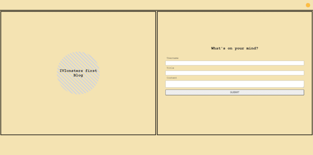
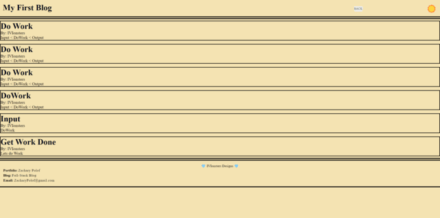
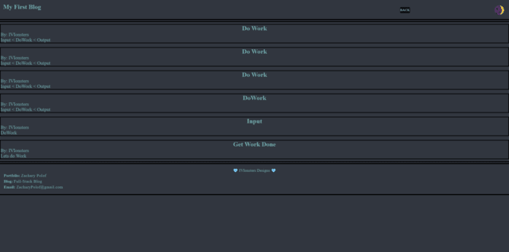

# IVIonsters-Designs-Blog
Personal Blog for IVIonsters Designs along my coding journey!

## Table of Contents

* [Description](#description)
* [Languages](#languages)
* [Features](#features)
* [Usage](#usage)
* [Credits](#credits)
* [License](#license)  

## Description
    Multi-page blog designed to allow the hosting of personal blogs and thoughts! 
    This blog is usable by all and the information is stored locally on your browser, 
    all thoughts are safe! Share some thoughts, enjoy the project! 

## Languages

* 
* 
* 

## Features

* **Alert Feature:** Project integrates JavaScript and .Alert feature to alert user if not all information is entered pertaining to blog requirements.
* **light / Dark Mode:** Blog features a toggle-able light and dark mode feature with correct images in header to switch modes. 
* **Form and Submission:** Blog has a fully functional form and submission feature to save history of written blogs.
* **Local Storage Feature:** Blogs will automatically be stored and be pulled from local storage.
* **Automated Posting:** Project features JavaScript code to automatically style and post new blogs with no input from user.
* **!! FOR DEVELOPERS ONLY !!:** Project features several console.log statements to display data acceptance along the code route.

## Usage

* For general use, simply fill in the required fields and put blog information in content section. Press submit and your blogs will be listed on the next page! 
* Toggle-able dark and light mode in upper right hand corner of header. Click Sun / Moon

* [IVIonsters-Designs-Blog-Live-Link](https://ivionsters.github.io/IVIonsters-Designs-Blog/)

* [IVIonsters-Designs-Blog-Repo](https://github.com/IVIonsters/IVIonsters-Designs-Blog)

* 
* 
* 
* 

## Credits

* [N/A](N/A)
## License

